# Дизайн-ревью главной SobolDev

24 сентября 2026 года. Новая задача сайта: представить дигитал-агентство, которое разрабатывает веб-приложения и Telegram Mini Apps для малого и среднего бизнеса, показать качество работ и привести к обсуждению проекта.

Главная уже имеет аккуратную основу, но пока воспринимается как персональный лендинг разработчика широкого профиля. Сильнее всего мешают тексты от первого лица, три равнозначных направления и отсутствие изображений проектов. Приоритет следующей итерации: ясная специализация, реальные работы и последовательный голос агентства.

Это аудит и предложение изменений. Рекомендации ниже ещё не внесены в интерфейс. В рамках задачи создан AGENTS.md с семью группами правил пользователя и финальным чек-листом.

## Основание и границы

Проверена локальная версия из текущего репозитория в браузере Codex: десктоп 1280 × 720, мобильные размеры 390 × 844 и 320 × 740. Для запуска использована отдельная копия существующей базы и отключены реальные внешние клиенты. Проверены главная, раскрытие FAQ, мобильное меню и передача выбранного направления в начало брифа. Все принятые скриншоты сохранены рядом с отчётом и просмотрены.

Скриншот Teak, приложенный пользователем, принят как референс композиции. Он не является текущей страницей SobolDev. Факты о проектах, команде и результатах клиентов независимо не подтверждались. Пустые обложки относятся к доступной локальной версии, а не к непроверенному production-сайту.

Не проверены: отправка заявки, серверные ошибки и успешная отправка, экранный диктор, реальный телефон, браузерный zoom 200%, производственные LCP/CLS/INP, реальное превью Telegram. Скриншоты и чтение кода не подтверждают полное соответствие WCAG. Фактически использованный файл каждого веб-шрифта отдельно не установлен; оценка визуальной типографики относится к зафиксированному рендеру.

## Последовательность проверки

| Шаг | Поверхность              | Состояние                                                                   |
| --- | ------------------------ | --------------------------------------------------------------------------- |
| 01  | Первый экран на десктопе | Чёткая иерархия, но общее обещание и декоративные макеты                    |
| 02  | Услуги                   | Аккуратные карточки; текст и приоритеты остались от личного портфолио       |
| 03  | Процесс                  | Понятная последовательность; занимает место перед доказательством качества  |
| 04  | Кейсы                    | Критический недостаток подачи: три пустые обложки                           |
| 05  | FAQ                      | Ответ открывается; вопросы полезны, но нет ориентира по стоимости Mini Apps |
| 06  | Финальный CTA            | Понятный выбор направления; повторяет часть следующего экрана               |
| 07  | Вход в бриф              | Выбор Telegram Mini App сохраняется; нужно повторное «Дальше»               |
| 08  | Главная, 390 px          | CTA виден без скролла; кейсы находятся слишком глубоко                      |
| 09  | Мобильное меню           | Открывается; Escape не закрывает                                            |
| 10  | Главная, 320 px          | Переполнения не обнаружено; длинный вводный текст занимает много места      |

## Что уже работает

Светлая нейтральная база, один фиолетовый акцент и ограниченная ширина основного контейнера дают странице порядок. Заголовки заметно крупнее текста. У H1 уже есть трекинг −3,5% и line-height 1,02; это не проблема, которую следует автоматически «исправлять» дополнительным уплотнением. У абзацев преимущественно line-height 1,625: немного выше указанного ориентира, но видимая читаемость не требует механического уменьшения.

FAQ построен на нативных details/summary. Есть глобальный focus-visible и правило prefers-reduced-motion. Переход из заключительного блока передаёт `type=tma`, форма показывает выбранный вариант. Большие CTA достаточно удобны: основной на 390 px имеет размер около 350 × 55 px. В доступном рендере на 320 и 390 px ширина документа совпала с шириной экрана.

В коде уже предусмотрены AVIF/WebP, srcset, lazy loading и размеры изображений. Есть собственная страница ошибки и favicon. Их не нужно создавать заново; страницу 404 отдельно в браузере не проверяли.

## Изменения по приоритету

В колонке After описано предлагаемое состояние, не выполненная правка. P1 влияет на понимание предложения и доверие; P2 улучшает удобство и качество деталей.

| Before                                                                                                                               | After                                                                                                                                                                             | Why                                                                                                                                                |
| ------------------------------------------------------------------------------------------------------------------------------------ | --------------------------------------------------------------------------------------------------------------------------------------------------------------------------------- | -------------------------------------------------------------------------------------------------------------------------------------------------- |
| **P1 · 01–03, 05–07.** «Студия», затем «веду», «собираю», «я делаю хорошо», «пришлю КП»                                              | Единый голос агентства во всей цепочке: главная, FAQ, бриф, метаданные. Личную ответственность основателя показать отдельно, с проверенными именем и ролью                        | Посетитель должен понимать, кто берёт ответственность за результат. Простая замена всех «я» на «мы» без реальной модели команды проблему не решает |
| **P1 · 01–02.** Веб, мобильная разработка и Mini Apps имеют одинаковый вес                                                           | Два основных направления: веб-приложения и Telegram Mini Apps. Нативную мобильную разработку убрать из главного обещания либо оставить вторичной услугой, если она сохраняется    | Новая специализация должна читаться за несколько секунд                                                                                            |
| **P1 · 01, 04.** В hero три бесконечно плавающих макета-заглушки; в кейсах три пустые обложки                                        | Один крупный реальный интерфейс в hero или сразу после него; далее два подробно представленных проекта. Демо явно подписать                                                       | Реальный продукт доказывает мастерство. Заглушки вызывают ощущение незавершённости                                                                 |
| **P1 · 04, 08.** Кейсы начинаются примерно на 2152 px десктопа и 3511 px мобильного документа                                        | Первый кейс сразу после короткого вступления. Порядок: предложение → работы → возможности → процесс → FAQ → контакт                                                               | До доказательств качества сейчас нужно пройти услуги и процесс                                                                                     |
| **P1 · 04.** Подпись обещает «задачу, решение и результат», карточки показывают описание и стек                                      | Для каждого кейса: задача, сделанный сценарий, роль агентства и подтверждённый итог; стек вторичным текстом внутри кейса                                                          | Названия технологий не объясняют пользу клиенту. Проценты роста без источника добавлять нельзя                                                     |
| **P1 · 01, 03.** «Бриф за 40 секунд» против «занимает пару минут»; «фиксированная цена» против «вилки цены»                          | Один основной CTA «Обсудить проект». Под ним ясное обещание следующего шага. Срок ответа и формат оценки сформулировать одинаково                                                 | Противоречия снижают доверие ещё до разговора                                                                                                      |
| **P2 · 01–04.** Три семейства шрифтов, много мелких разреженных моноширинных подписей 10–12 px                                       | Inter для основного интерфейса, Unbounded только для коротких брендовых заголовков. Технические подписи сделать спокойными, читаемыми, без третьего постоянного шрифтового голоса | Сохранить узнаваемость и уменьшить визуальный шум. Качество кириллицы проверить с реально загруженными шрифтами                                    |
| **P2 · 01.** Сетка, фиолетовое свечение, парящие карточки, тени и полупрозрачная навигация одновременно                              | Оставить один фирменный приём: тонкую сетку в области реального интерфейса либо аккуратную систему подписей к проектам. Убрать свечение и макеты-заглушки                         | Сдержанность возникает через выбор, какие детали действительно нужны                                                                               |
| **P2 · 04.** Все проекты одинаковыми небольшими карточками на резком тёмном блоке                                                    | Один ведущий проект крупно и второй дополнительный; общий светлый фон, цвета самих продуктов внутри обложек                                                                       | Работы получают масштаб и индивидуальность. Тёмный блок можно сохранить, если реальные скриншоты выигрывают на нём                                 |
| **P2 · 05.** FAQ перечисляет цены на лендинг, магазин и мобильное приложение, но не на Mini Apps                                     | Добавить содержательный ответ о составе Mini App, интеграциях, поддержке и оценке. Цену публиковать только после подтверждения                                                    | FAQ должен отвечать на вопросы новой целевой аудитории                                                                                             |
| **P2 · 06–07.** Тип уже выбран на главной, но бриф снова показывает выбор; его контейнер визуально растянут до общей ширины страницы | Сохранить возможность изменить тип, начинать со следующего содержательного шага. Восстановить отдельную ширину формы около 720–760 px                                             | Уменьшить повторение и облегчить сканирование формы                                                                                                |
| **P2 · 08.** Три показателя идут вертикально и растягивают первый блок до 1043 px                                                    | Сократить вводный текст; оставить одну доказуемую строку фактов либо компактную группу после первого кейса                                                                        | Мобильная композиция должна иметь собственные приоритеты                                                                                           |
| **P2 · 09.** Меню остаётся открытым после Escape; кнопка 40 × 40 px                                                                  | Добавить Escape с сохранением/возвратом фокуса на кнопку, `aria-controls`, увеличить цель до 44–48 px                                                                             | Предсказуемое управление и комфорт касания. 40 px само по себе не является нарушением минимального требования WCAG 2.2 AA                          |
| **P2 · код UI.** У Button нет явной реакции на нажатие; у обложек `duration-slow: 700ms`                                             | Короткий pointer-active feedback 100–160 ms; hover обложек 160–220 ms или без движения. Указывать конкретные свойства перехода                                                    | По emil-design-eng действие должно ощущаться сразу. Не добавлять движение при reduced motion и клавиатурной навигации                              |
| **P2 · метаданные.** Главная не выдаёт `og:image`; title всё ещё включает мобильные приложения                                       | Подготовить фирменное OG-превью 1200 × 630 с коротким предложением и настоящим интерфейсом, обновить title/description                                                            | Пересылка в Telegram должна передавать новую специализацию и выглядеть завершённо                                                                  |

## Цвет, геометрия и доступность

Расчёт по существующим токенам, без сглаживания и сложных фонов:

| Пара                                       | Контраст | Вывод                                                                                     |
| ------------------------------------------ | -------- | ----------------------------------------------------------------------------------------- |
| `muted #6c6c7a` / `paper #f1f2f5`          | 4,62:1   | Проходит 4,5:1, запас небольшой                                                           |
| `muted` / белый                            | 5,17:1   | Проходит                                                                                  |
| Белый / `accent #4a3aff`                   | 6,29:1   | Проходит                                                                                  |
| `accent-bright #8f83ff` / `night2 #15151e` | 5,92:1   | Проходит                                                                                  |
| `accent #4a3aff` / `night2`                | 2,88:1   | Недостаточно для обычного текста; проверить этот цвет в кольце фокуса на тёмных карточках |

Порог 4,5:1 для обычного текста указан в [W3C, Contrast Minimum](https://www.w3.org/WAI/WCAG21/Understanding/contrast-minimum/). Размер цели 24 × 24 CSS px с исключениями относится к [WCAG 2.2, Target Size Minimum](https://www.w3.org/TR/WCAG22/#target-size-minimum); 44–48 px здесь рекомендация по удобству.

Нельзя объявлять весь серый текст неконтрастным по впечатлению. Проблема мелких подписей скорее в сочетании размера, разрядки и значимости. Отдельно нужно замерить текст поверх hero-wash и полупрозрачную шапку на разных участках страницы.

Основные интервалы уже в основном кратны 4 px. Оставить существующую шкалу, а мелкие оптические коррекции иконок не выравнивать механически. Нужна ревизия локальных радиусов: в hero используются 8/14/18/22 px, в системе 16/24 px и pill. Например, у ProjectCard внутренний радиус 16 px при отступе 20 px и внешнем 24 px; по формуле пользователя это требует визуальной проверки, а не автоматической установки 36 px.

У radiogroup в финальном CTA нет доступного имени: связать группу с видимым вопросом через `aria-labelledby` или использовать fieldset/legend. Глобальный focus-visible уже есть; для тёмного блока нужен отдельный контрастный токен. Skip-link к main в проверенной разметке отсутствует.

Reduced motion обрабатывается в CSS, но взаимодействия с включённой системной настройкой отдельно не воспроизводились. Нативный FAQ можно оставить без анимации высоты. Его текущий `block-size` transition запускает перераскладку; это кандидат на упрощение, а не доказанная проблема производительности. Отсутствие media query рядом с Tailwind `hover:` в Svelte-файле само по себе не доказывает ошибку на touch: надо смотреть сгенерированный CSS.

## Направление для следующей версии

Для малого и среднего бизнеса выбрана светлая тёплая подача на существующей системе SobolDev: фон цвета бумаги, тёмный махагон для действий, ясные заголовки и умеренные скругления. Фирменность строится на том, как агентство показывает сделанное: понятные сценарии продаж и записи, подписи к ключевым экранам и ясное объяснение, кто отвечает за работу. Это персонализация через реальные задачи бизнеса и подход.

Из Teak полезны асимметрия первого экрана, левое выравнивание текста, отдельное место для продукта и понятная ведущая кнопка. Жёлто-розовую игровую палитру, декоративные фигуры, цифры и обещания Teak переносить не нужно. На присланном скриншоте виден только первый экран; остальной сайт Teak не оценивался.

Предлагаемый текст первого экрана, пока как редакционный черновик:

> Веб-приложения и Telegram Mini Apps
>
> Разрабатываем сервисы для продаж, записи и работы с клиентами. Проектируем интерфейс, подключаем нужные системы и помогаем с запуском.
>
> **Обсудить проект** · Смотреть работы

Фразы о сопровождении и составе работ надо сверить с фактическим предложением агентства. Отдельная короткая строка под CTA может объяснять, что клиент получит после обращения. Сроки и цены не добавлять без подтверждения.

Рекомендуемая композиция: компактная шапка с работами на первом месте → короткое предложение и реальный интерфейс → два кейса → два направления услуг → процесс с результатом каждого этапа → подтверждённые участники и роли, если материал есть → FAQ → единый CTA и прямой контакт. На мобильном: предложение, кнопка и превью работы раньше любых длинных списков.

## План внедрения и приёмки

1. Согласовать единый текст предложения и реальные факты. Проверить «7 лет», «40+», сроки и цены; сохранить только подтверждённые заявления.
2. Подготовить настоящие изображения двух проектов и содержание кейсов. Если клиентские работы пока нельзя показать, использовать честно подписанный демонстрационный проект, не выдавая его за коммерческий результат.
3. Перестроить верх страницы и порядок секций на текущих компонентах. Убрать дублирующую услугу и декоративные макеты из основного сценария.
4. Привести CTA, FAQ, бриф и SEO к одному предложению. Доработать меню, имя radiogroup, тёмный фокус и реакцию кнопок.
5. Проверить 320/390/768/1280 px, zoom 200%, клавиатуру, reduced motion, загрузку шрифтов и реальных изображений. Отдельно прогнать ошибку/успех отправки и проверить превью ссылки в Telegram.

Критерий успеха: за первый экран понятно, что делает агентство и как обратиться; следующий смысловой блок показывает настоящий продукт. Работы читаются раньше длинного описания процесса. У каждой интерактивной части различим фокус, а мобильная страница сохраняет смысловую иерархию.

## Что было изменено на этапе ревью

- Найдены: несоответствие нового позиционирования текстам, отсутствие обложек, поздняя подача кейсов, противоречия CTA и обещаний, недостатки меню, метаданных и некоторых состояний.
- Выполнено: создан корневой AGENTS.md с правилами пользователя; сохранён этот отчёт и десять снимков текущего состояния.
- Без изменений на момент ревью: код интерфейса, содержимое базы, палитра и компоненты. Последующая реализация описана ниже.

## Снимки и заметки

1.  Первый экран, десктоп. Главный заголовок и CTA различимы; макеты не демонстрируют реальную работу.

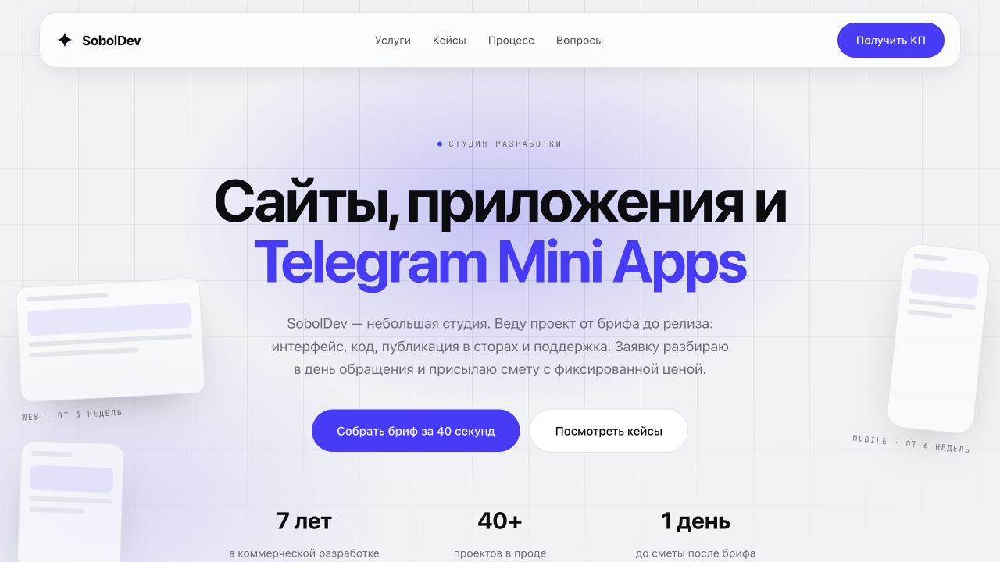

2.  Услуги после перехода по навигации. Сохраняется личное позиционирование и три равнозначных направления; нижняя часть карточек продолжается за границей кадра.

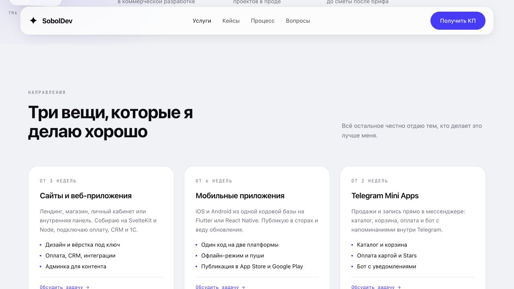

3.  Процесс. Спокойная композиция; полезный блок, который стоит расположить после кейсов.

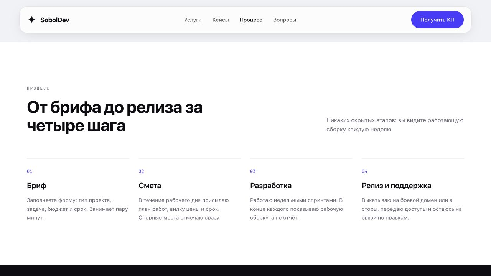

4.  Кейсы. Видны пустые обложки и акцент на технологическом стеке; нижняя часть карточек продолжается ниже кадра.

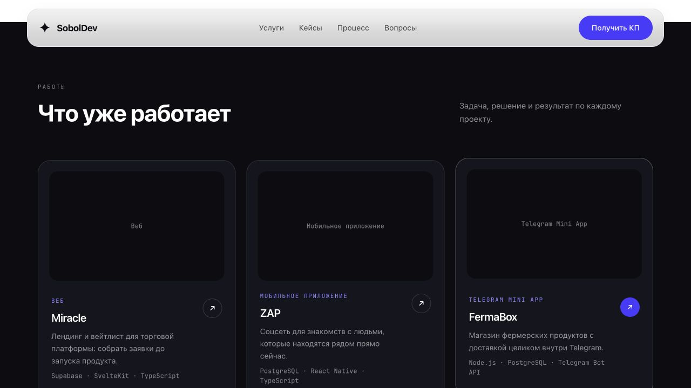

5.  FAQ, открыт вопрос о цене. Ответ читается, но Mini Apps в ценовых ориентирах отсутствуют.

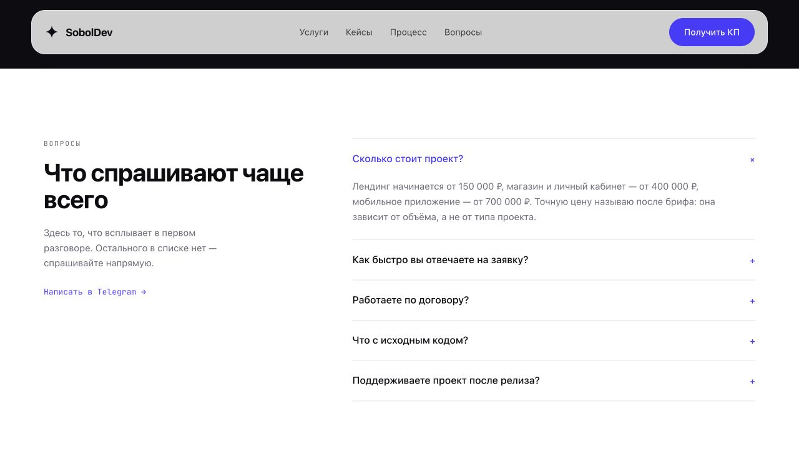

6.  Заключительный CTA. Выбор направления понятен; фиолетовая поверхность и рамка усиливают друг друга.

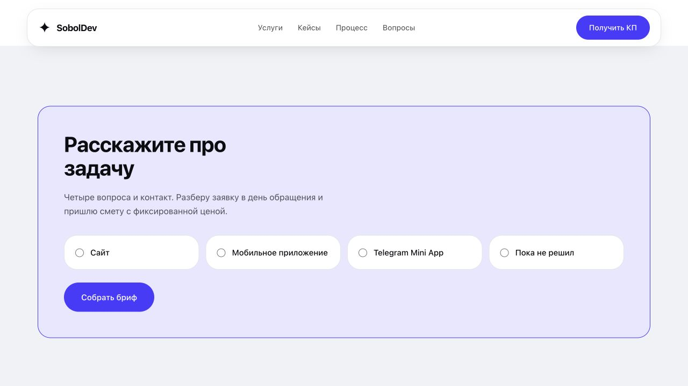

7.  Бриф после выбора Telegram Mini App. Тип сохранён; контейнер формы визуально занимает общую ширину сайта.

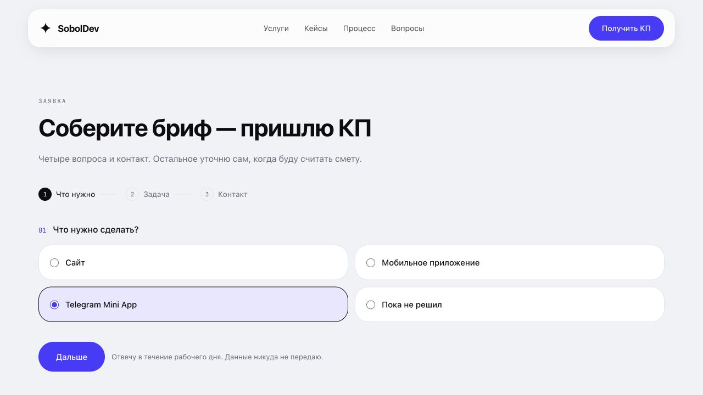

8.  Мобильный первый экран, 390 px. CTA доступен без прокрутки, показатели уходят в длинную вертикальную последовательность.

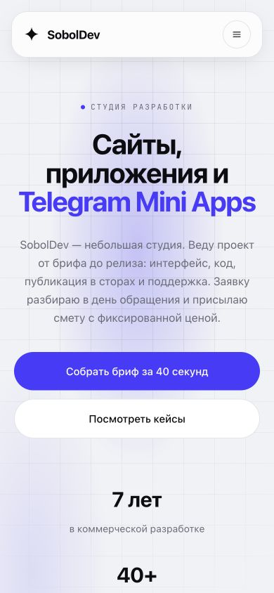

9.  Мобильное меню. Виден основной CTA, но Escape не закрывает список.

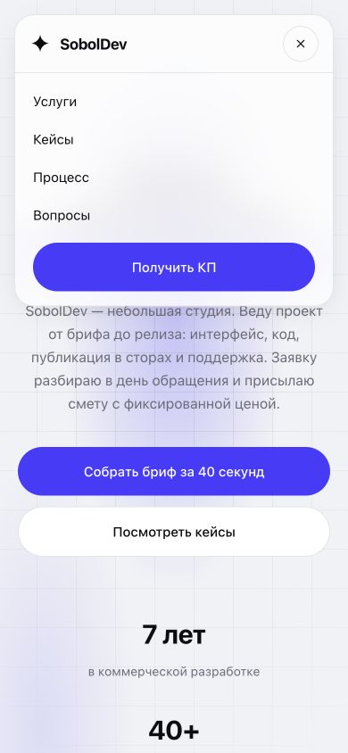

10. Узкий экран, 320 px. Заголовок переносится без горизонтального переполнения; фокус кнопки меню виден.

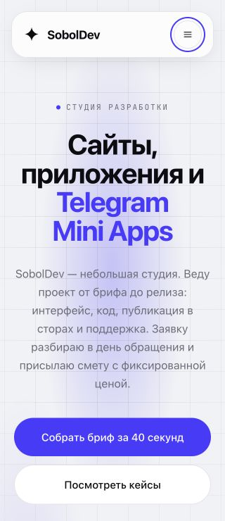

## Промежуточная версия (архив)

На этом этапе по обратной связи вместо фиолетового и почти чёрно-белого варианта использовались тёплый бумажный фон `#F5F2ED`, тёмный текст `#26211D` и махагон `#5B382D` для действий. Контраст основного текста и кнопок превышал WCAG AA. Ниже сохранены снимки этой версии для сравнения.

Главная теперь представляет два основных направления — веб-сервисы и Telegram Mini Apps. Декоративные макеты и неподтверждённые цифры удалены; блок работ перемещён сразу после первого экрана. Карточка без обложки показывает текст проекта вместо пустой рамки. Бриф, страница работ и подтверждение заявки приведены к единому голосу. Добавлены OG-изображение главной и закрытие мобильного меню клавишей Escape.

Реальные обложки и проверяемые результаты проектов не добавлялись: в проекте нет материалов, которые можно честно выдать за такие свидетельства. Страница 404 и фавикон уже существовали, поэтому остались без изменений.

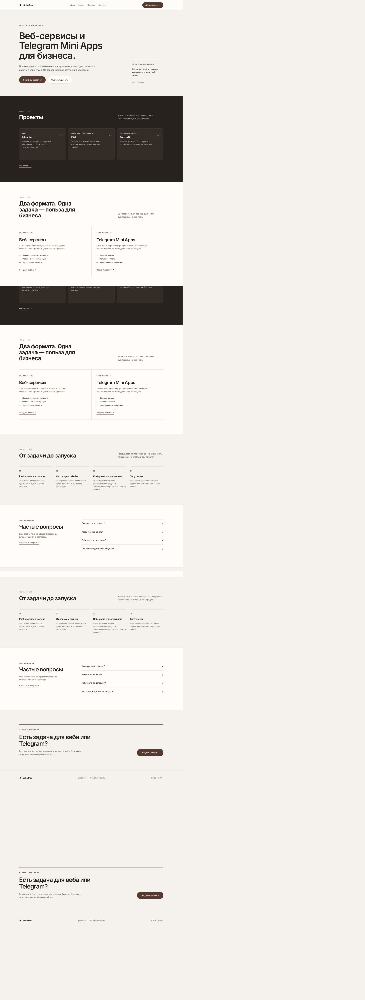

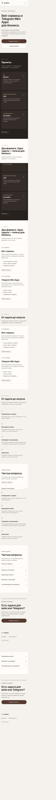

## Возврат первого экрана

После сравнения пользователь предпочёл первоначальный hero. Восстановлены его композиция, сетка, мягкое лиловое свечение, три плавающие рамки, центрированный заголовок, две кнопки и показатели. Для точного визуального соответствия возвращена исходная палитра сайта; OG-превью обновлено в тех же цветах. Остальные секции сохранили порядок и подачу промежуточной версии, а текст под заголовком говорит от лица студии.

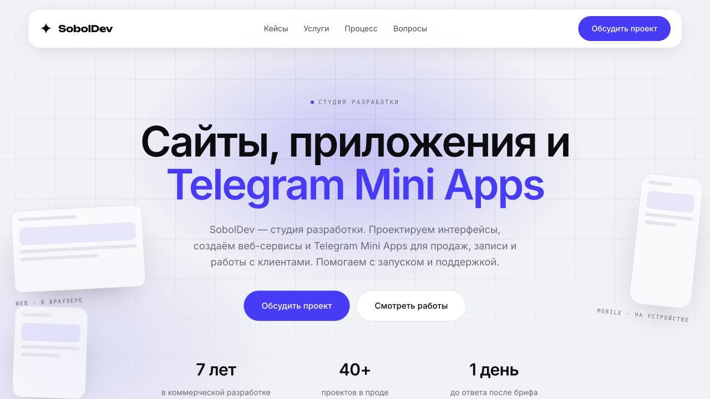

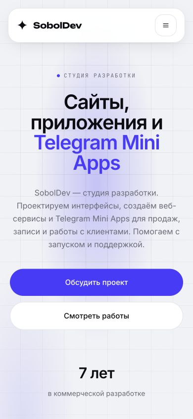
